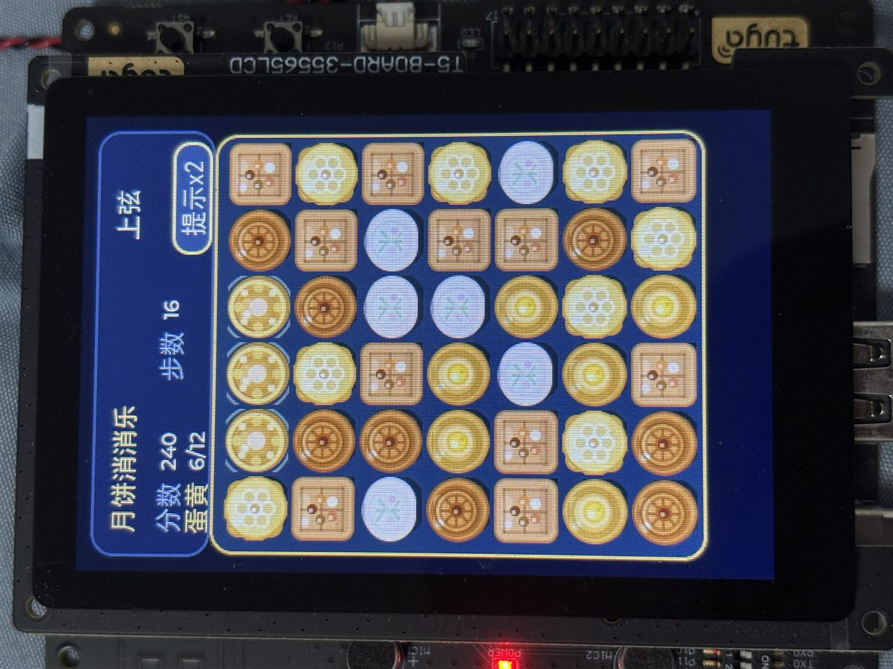
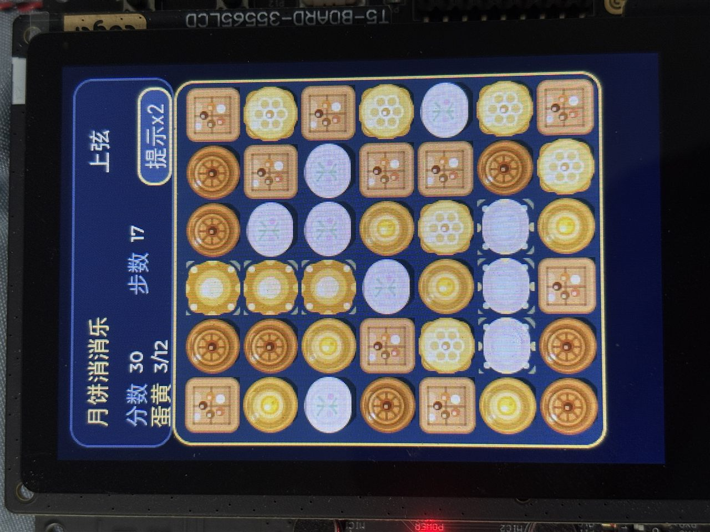
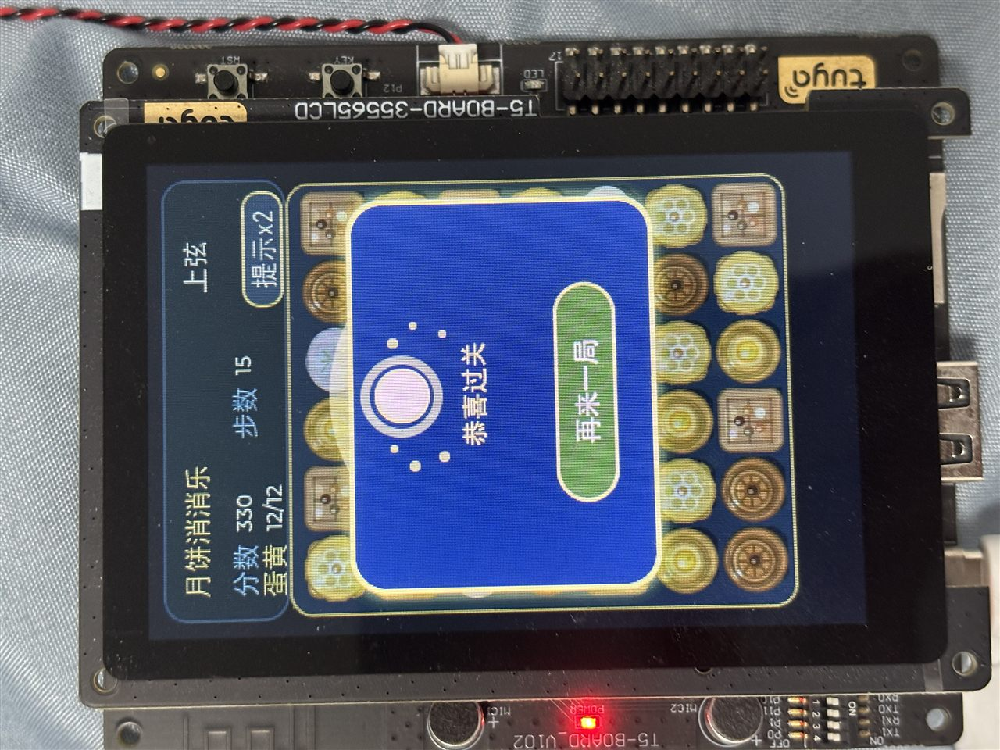
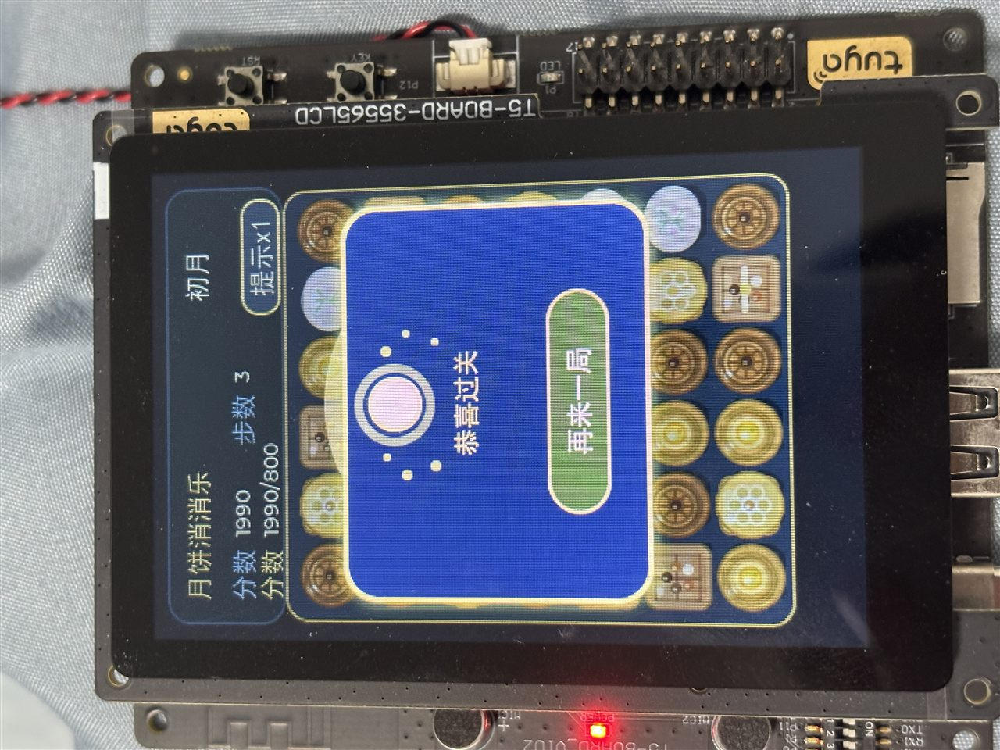
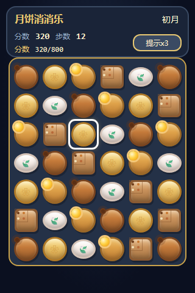
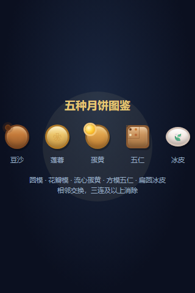
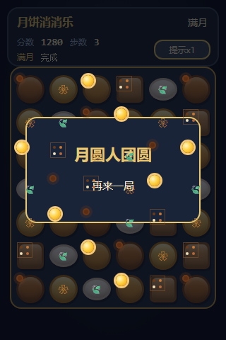

# 月饼消消乐 (moon)

中秋主题 **三消益智游戏**，基于 [TuyaOpen](https://github.com/tuya/TuyaOpen) 运行在 **T5AI** 开发板 + **3.5 寸触控屏** 上。

[](LICENSE)

## 真机实拍

<p align="center">
  
</p>

<p align="center">
  
  
  
</p>

演示视频：[demo-01](docs/real/demo-01.mp4) · [demo-02](docs/real/demo-02.mp4) · [demo-03](docs/real/demo-03.mp4)  
更多实拍说明：[docs/real/README.md](docs/real/README.md)

## 界面示意

<p align="center">
  
  
  
</p>

## 亮点

- 6×7 棋盘三消，五种卡通月饼（圆模 / 花瓣 / 蛋黄 / 方模 / 冰皮）
- 三关：初月（分数）→ 上弦（蛋黄）→ 满月（分数）
- 触摸交换 + 屏幕提示键（每关 3 次）+ 板载按键提示
- 消除特效、失败/成功音效、LED 与背光反馈
- 功能说明：[docs/游戏功能介绍.md](docs/游戏功能介绍.md)

## 硬件

| 项目 | 说明 |
|------|------|
| 主板 | Tuya T5AI Board（T5-BOARD-35565LCD） |
| 显示 | 3.5" LCD + 触摸 |
| 其它 | 板载喇叭、LED、按键 |

## 快速开始

依赖：[TuyaOpen SDK](https://github.com/tuya/TuyaOpen) 与本机工具链（可用 TuyaOpen IDE）。

```bash
# 激活 SDK 环境后：
cd source/embedded
tos.py check
tos.py build
tos.py flash -p COMx   # Windows 例：COM4
```

主要源码：

- `source/embedded/src/app_mooncake.c` — 游戏逻辑与 UI
- `source/embedded/src/moon_font.c` — 中文字体子集
- `source/embedded/src/tuya_app_main.c` — 入口

## 目录结构

```
moon/
├── docs/
│   ├── real/             # 真机实拍照片与视频
│   ├── screenshots/      # UI 示意截图
│   └── 游戏功能介绍.md
├── source/embedded/      # 固件（tos.py build）
├── .tuyaopen/            # 项目元数据（不含本机 IDE 私有文件）
├── LICENSE               # Apache-2.0
└── README.md
```

## 开源许可

本项目以 **Apache License 2.0** 开源，详见 [LICENSE](LICENSE)。

TuyaOpen SDK、板级驱动等第三方组件遵循其各自许可证。

## 贡献

欢迎 Issue / PR：修 bug、加关卡、改进月饼绘制或音效都可以。
