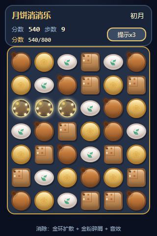
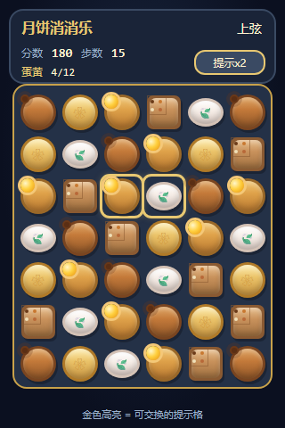

# 月饼消消乐 — 游戏功能介绍

> 项目：`moon`　平台：TuyaOpen T5AI　屏幕：3.5 寸触控 LCD（320×480）  
> 本文配图为按真机界面比例还原的示意截图，便于介绍与评审；实机显示效果以烧录固件为准。

---

## 1. 游戏简介

**月饼消消乐**是一款中秋主题的三消益智小游戏，运行在 Tuya T5AI 开发板上。玩家在 6×7 棋盘上交换相邻月饼，连成三个及以上即可消除，争取在有限步数内完成关卡目标。

| 项目 | 说明 |
|------|------|
| 玩法 | 三消（Match-3） |
| 棋盘 | 6 列 × 7 行 |
| 棋子 | 5 种卡通月饼（外形与花纹各异） |
| 关卡 | 3 关：初月 → 上弦 → 满月 |
| 操作 | 触摸点选交换；右上角「提示」可求助 |
| 反馈 | 音效、LED 闪烁、屏幕亮度、消除特效 |


*图 1　主界面：顶部 HUD + 棋盘 +「提示」按钮*

---

## 2. 界面说明

### 2.1 顶部信息栏（HUD）

| 元素 | 作用 |
|------|------|
| 标题「月饼消消乐」 | 游戏名 |
| 关卡名（初月 / 上弦 / 满月） | 当前关卡 |
| 分数 | 本关累计得分 |
| 步数 | 剩余可交换次数 |
| 目标 | 本关过关条件进度 |
| **提示xN** | 点按后高亮一对可消除交换（每关 3 次） |

### 2.2 棋盘区

- 深蓝底 + 金色描边面板，契合中秋夜色氛围。
- 每种月饼带独立外形与压模花纹，方便辨认。
- 选中格：白色描边高光。
- 提示格：金色描边闪烁。

---

## 3. 五种月饼图鉴


*图 2　五种月饼外形与规则摘要*

| 种类 | 外形 | 视觉特征 |
|------|------|----------|
| 豆沙 | 经典圆模 | 焦糖暖棕皮，八角压纹花心 |
| 莲蓉 | 花瓣边圆模 | 金黄油皮，六瓣莲花印 |
| 蛋黄 | 圆模 | 琥珀皮 + 流心蛋黄俯视效果 |
| 五仁 | 传统方模 | 井字格 + 五色果仁点 |
| 冰皮 | 扁圆软皮 | 粉白皮 + 桂叶桂花印 |

> 操作规则一句话：**相邻交换，三连及以上消除。**

---

## 4. 核心玩法

### 4.1 基本操作

1. 点选一枚月饼（出现白框）。
2. 再点相邻一格（上下左右），尝试交换。
3. 若交换后能形成 ≥3 连，则消除并计分；否则交换回退。

### 4.2 得分与连锁

- 基础分随消除数量增加，连消（cascade）有倍率加成。
- 4 连、5 连可生成特殊月饼（行消 / 列消 / 满月彩球等）。
- 消除时伴有：金环扩散、金粉碎屑、旋律音效、板载 LED 闪烁。



*图 3　消除成功时的金环与粒子特效*

### 4.3 无效交换

- 交换后无法形成消除时：棋子弹回。
- 播放下行「错误」双音。
- 相关两格短暂红框提示。

### 4.4 提示功能



*图 4　点击「提示」后，可交换的两格金色高亮*

- 位置：HUD 右下角按钮（避免贴底难触控）。
- 每关 **3 次**；用完显示「已用完」。
- 成功时：高亮两格 + 提示音 + LED。
- 板载物理按键单击同样可触发提示。

---

## 5. 关卡设计

| 关卡 | 名称 | 步数 | 过关目标 |
|------|------|------|----------|
| 1 | **初月** | 15 | 分数达到 **800** |
| 2 | **上弦** | 18 | 消除蛋黄月饼累计 **12** 个 |
| 3 | **满月** | 20 | 分数达到 **1200** |

- 达成目标 → 过关结算，点「再来一局」进入下一关（最后一关通关文案为「月圆人团圆」）。
- 步数用尽且未达成 → 「步数用尽」，可重开本关。
- 无解局面时自动重排棋盘。


*图 5　通关结算遮罩（点击任意处继续）*

---

## 6. 特殊棋子（简述）

| 类型 | 来源（典型） | 效果意象 |
|------|----------------|----------|
| 行消 / 列消 | 4 连 | 桂花金条印，清一整行或一整列 |
| 炸弹（玉兔） | 交叉消除等 | 玉兔印，范围爆炸 |
| 满月彩球 | 5 连 | 金色满月印，同色全消 |

特殊棋参与匹配时可触发更大清屏与更高分。

---

## 7. 音效与硬件反馈

| 场景 | 反馈 |
|------|------|
| 消除成功 | 上行短旋律（连锁越长音越高） |
| 无效交换 | 下行双音 + 红框 |
| 使用提示 | 清脆三连音 + LED |
| 过关 | 上行胜利琶音 + 屏幕提亮 |
| 失败 | 下行低音 + 屏幕变暗 |
| 消除瞬间 | 背光脉动 + LED 闪两下 |

---

## 8. 操作速查

```
点选 A → 点选相邻 B → 能消则消，不能则弹回并报错音
右上角「提示xN」→ 高亮一对可走步（每关 3 次）
过关 / 失败弹窗 → 点击屏幕「再来一局」
```

---

## 9. 截图索引

| 文件 | 内容 |
|------|------|
| [`screenshots/01-main.png`](screenshots/01-main.png) | 主界面与选中态 |
| [`screenshots/02-hint.png`](screenshots/02-hint.png) | 提示高亮 |
| [`screenshots/03-match.png`](screenshots/03-match.png) | 消除特效 |
| [`screenshots/04-win.png`](screenshots/04-win.png) | 通关结算 |
| [`screenshots/05-cakes.png`](screenshots/05-cakes.png) | 五种月饼图鉴 |

示意页源文件位于 [`docs/mockup/`](mockup/)，可本地用浏览器打开微调后重新截图。

---

## 10. 编译与烧录（开发者）

```bash
cd source/embedded
tos.py build
tos.py flash -p COMx
```

硬件依赖（已确认）：3.5" LCD + 触摸、喇叭、板载 LED、板载按键。

---

*文档版本：与固件 `moon 1.0.0` 中秋消消乐功能对齐 · 2026-09-25*
